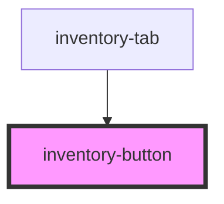

# inventory-button

<!-- Auto Generated Below -->

## Properties

| Property   | Attribute  | Description | Type      | Default |
| ---------- | ---------- | ----------- | --------- | ------- |
| `selected` | `selected` |             | `boolean` | `false` |
| `text`     | `text`     |             | `string`  | `''`    |
| `variant`  | `variant`  |             | `string`  | `''`    |

## Dependencies

### Used by

 - [inventory-tab](../../molecules/inventory-tab)

### Graph

----------------------------------------------

*Built with [StencilJS](https://stenciljs.com/)*
